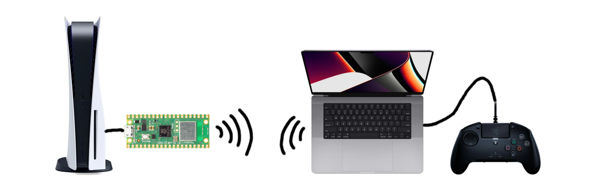

# PlayStation controller authentication as a service



This is a proof of concept of a client-server solution to the PlayStation controller authentication problem.

It applies to PS4 controllers, but is mostly useful in PS5 context, because oficially licensed specialty peripherals (arcade sticks, steering wheels) work with certain PS5 games.

There are two components: a Raspberry Pi Pico W that is connected to a PS5 and works as a controller and a network server running on a computer with a licensed PS4 controller connected to it. When the PlayStation issues an authentication challenge to the Pico, it forwards it over the network to the computer with the real controller connected, the computer asks the controller for a response and then forwards it back to the Pico connected to a PS5.

Why would it be useful at all? With this architecture, it would be possible for one licensed controller to act as an authentication backend for multiple controllers at the same time.

I only tested it with a Razer Raion, but it should in theory work with other licensed PS4 controllers. If you use a different controller, change `VENDOR_ID` and `PRODUCT_ID` in `auth_server.py`.

## How to compile

```
git clone https://github.com/jfedor2/paaas.git
cd paaas
git submodule update --init
cd pico-sdk
git submodule update --init
cd ..
# Edit src/config.h with your settings.
mkdir build
cd build
cmake ..
make
```
